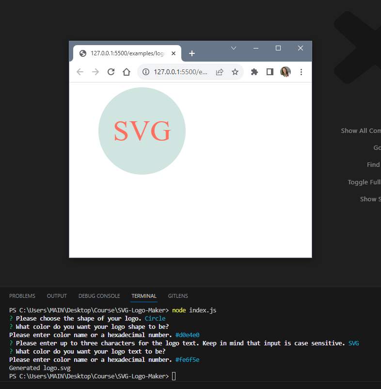
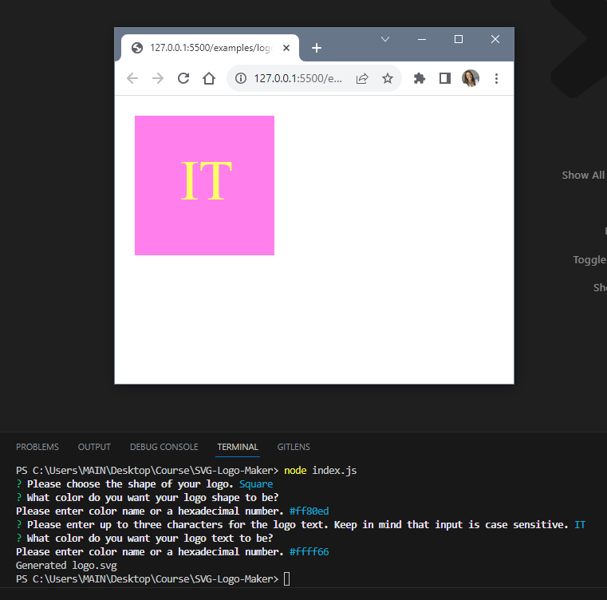
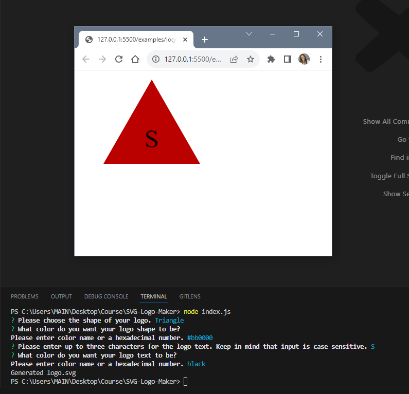

# SVG Logo Maker

## Description
This is a command-line application that takes in user input to generate a logo and save it as an SVG file.  
Its purpose is to generate a simple logo.  
The application prompts the user to select a color and shape and provide text for the logo.

## Installation:
Run "npm install" before running the application by typing "node index.js". 

## Usage
After running "node index.js" answer the questions. After every answered question press "Enter"

Preview:

Video walk-through:

[SVG-Logo-Maker-Video](https://drive.google.com/file/d/11hOGVh3fNFib-CYiG16O9b59drf_zsAU/view)

## Testing
To test the application run "npm test".

## License
Please refer to the LICENSE in the repo.
